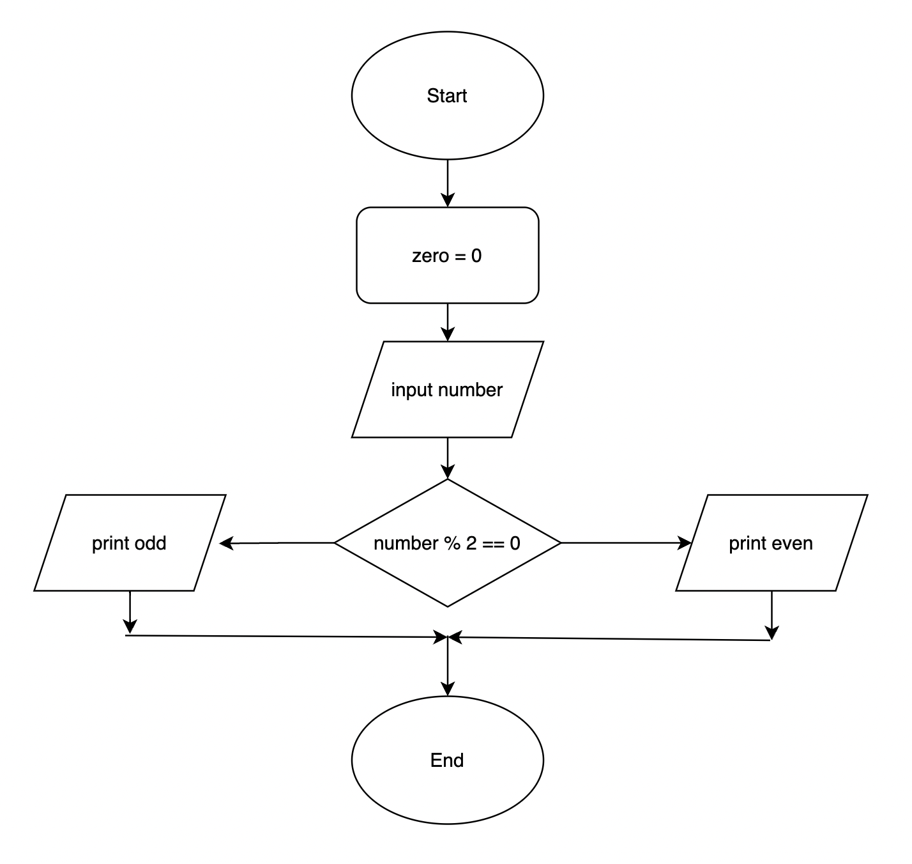

# Flowcharts

## Overview

A helpful method for breaking down a problem into clear steps is to utilize a flowchart.

Flowcharts serve as a graphical representation of a set of instructions.

They are frequently employed in programming to outline the necessary steps for the application to function as intended.

## Symbols

### ***Symbols***

The following standard symbols are used to construct a flowchart and each symbol represents a different type of instruction.

| Symbol                                    |   Meaning    |   Description    |
|-------------------------------------------|   ---     |   ---     |
|                 |  **`START / END`**     |   Oval shapes are used to represent the start and end points of the flowchart |
|               |  **`FLOW LINES`**      |   Arrows *(also known as flow lines)* are used to connect the symbols in a flowchart and indicate the direction of flow |
|  |  **`INPUT / OUTPUT`**  |   Parallelograms are used to illustrate inputs and outputs, which are usually user actions |
|       |  **`PROCESS`**         |   Rectangles symbolise processes such as calculations like arithmetic operations |
|           |  **`DECISION`**        |   Diamond shapes indicate a point of decision  |

## Use case example

### Requirement
Write a piece of code which checks to see if an inputted number is even. Print out `odd` or `even` depending on the result.

### First step

First create a flowchart to have a step-by-step approach to the problem. Flowchart will be the guide to writing the code.

Break down the problem into smaller steps:

1) Start
2) Process - declare a variable and initialize it to `0`. This variable will store the user input number.
3) User input - Ask the user to enter a number, and convert the number to integer.
4) Decision - Complete modulus division on the user input number and if the number is `0`, number is even. 
5) Output - Print `odd` or `even depending on the decision
6) End

Here is the flowchart designed based on the previously stated steps:



### Second step

Looking at the flow chart write the code, it should look like this:

```python
zero = 0
num = int(input("Please enter a number: "))
if num % 2 == zero:
  print(num,"is even")
else:
  print(num,"is odd")
```

Each line of code represent a step in the flowchart.
