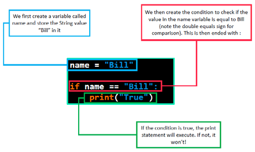
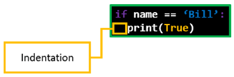
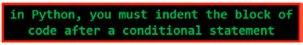
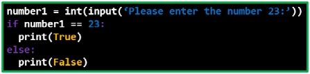

# Conditionals

## Overview

Often a computer program must make choices on which way to proceed based on certain conditions.

For example, if the temperature is above 30°C then turn on the AC but if it is below then turn on the heater.

Conditional statements such as `if`, `else if` and `else` are used in programming to process conditions.

## Control Flow

Before we look further into conditionals, it is important to consider the way in which code executes.

Earlier, we touched on how Python, like every other major programming language, executes from top to bottom. 
Essentially once a line of code has completed, the compiler will always move down the program by one line.

Control flow is simply the order that lines of code are executed in. 
By using statements which manipulate the flow of a program, the programmer can determine which section of code is run in a program at any time.

It is important to master this art.

It is critical to understand, in any program, which blocks of code are going to execute, and when. 
This is important not only for writing your own programs, but for reading and understanding code that you haven’t written.

## Conditions

In some cases you want only certain sections of code to run based on a certain condition. For example:

```python
temp = 30
if temp > 30
    print("Turn the AC off")
else
    print("Turn heater on")
```

In the following code example you should see that the `print("Turn the AC off")` will only be executed when the `temp` will be more than 30.

## Operators

There are several other operators which can be used within conditional statements, some of which you may recognise from mathematics:

|   Operator    |   Function    |
|   --- |   --- |
|   **`>`**   |   Greater than    |
|   **`<`**   |   Less than   |
|   **`==`**  |   Equal to    |
|   **`!=`**  |   Not equal to    |
|   **`>=`**  |   Greater than or equal to    |
|   **`<=`**  |   Less than or equal to   |

To check if a condition is True, we can use these operators alongside conditional statements.

Here are some examples for the operators above:

```python
x = 5
y = 10

# Equal to
print(x == y)             # False

# Not equal to
print(x != y)             # True

# Greater than
print(x > y)              # False

# Less than
print(x < y)              # True

# Greater than or equal to
print(x >= y)             # False

# Less than or equal to
print(x <= y)             # True
```

### if

The most well-used conditional statement is the `if-statement`. 
If a condition evaluates to being `True`, then any code indented within the `if-statement` is run.

In Python, it looks like this:



If, for whatever reason, we assigned a variable called `name` to something that was not `Bill`, 
then the `print` statement would never run - the compiler would simply skip over that line of code.



As you can see, the code which depends on the `if-statement` is indented. 
The reason for this is extremely important:



An indentation is `4 spaces` which is also the equivalent of `1 tab`.

By laying out code in this way, both the programmer and the compiler can clearly see which blocks of code execute in which situations.

### else

Else is a catch-all conditional statement. It is used to check any cases which an if-statement does not check for.

For instance, let’s look at the following code:



In this code, we ask the user to enter the number 23 – and, in any case where the number 23 is not entered, the `else-statement` will activate and print `False` to the screen.

### elif

We don’t always need our programs to check if every condition evaluates to True. 
In a lot of cases, only one condition can be True.

This issue can be solved by using an else-if-statement. 
The else-if-statement is defined in Python as `elif`.

By using an elif-statement, you can make your code more efficient.

Here's a real life example of how you could use `elif`.

```python
score = 75

if score >= 90:
    grade = 'A'
elif score >= 80:
    grade = 'B'
elif score >= 70:
    grade = 'C'
elif score >= 60:
    grade = 'D'
else:
    grade = 'F'

print(f"Your score is {score}, and your grade is {grade}.")
```

### Tutorial

Writing an **if-statement**

```Python
speed = 23
if speed > 70:
  print("over speed limit")
```

Building on the **if-statement** with an **elif-statement**:

```Python
speed = 23
if speed > 70:
  print("over speed limit")
elif speed == 70:
  print("right speed")
```

Combining the **if**, **elif** and **else** statements:

```Python
speed = 23
if speed > 70:
  print("over speed limit")
elif speed == 70:
  print("right speed")
else:
  print("under speed limit")
```
