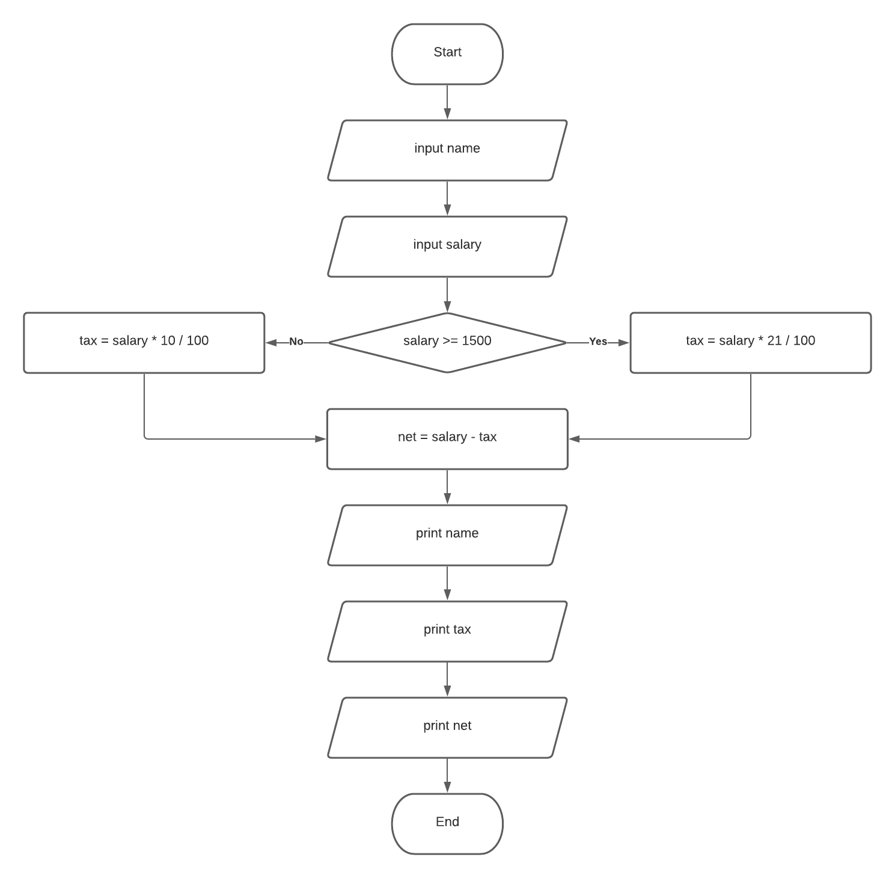
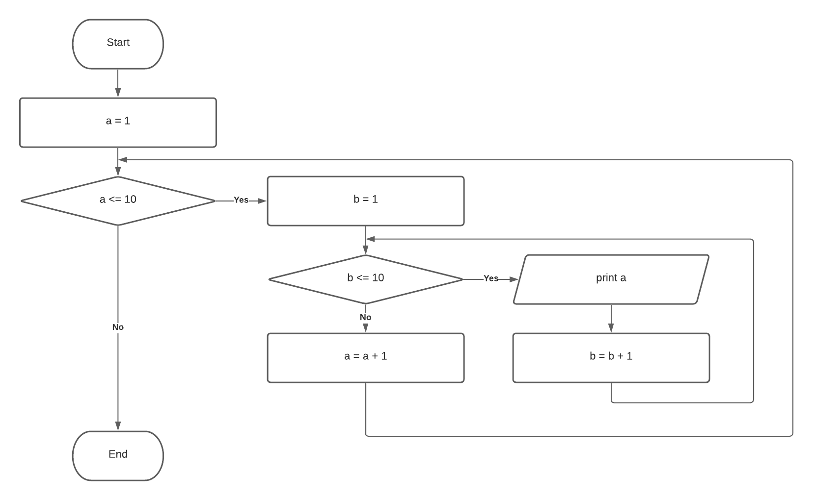

# Exercises

## Overview

In this module, you will look at how to approach two different types of problems in order to create solutions for them in Python.

## Tutorial

### Working from Flowcharts

For these types of problems, you will be given a **flowchart** which you will need to convert into Python syntax.
This type of exercise will require you to think logically about what the flowchart is doing before attempting to translate it.

#### Recap

In flowcharts:
- Oval - represents the `Start` and `End` of our program.
- Rectangle - represents processes done in single lines of code.
- Parallelogram - represents an input or an output.
- Diamond - represents a condition.

#### Example 1

Take a look at the following flowchart:


We can see that the program needs to take an input, then, depending on the value of the input, print an output, then end.

Try and work this out on your own before looking at the solution below.

<details><summary>Answer</summary>

```python
num = int(input('Please enter a number: '))
if num % 2 == 0:
    print(num, "is even")
else:
    print(num, "is odd")
```

</details>

### Working from Solutions

For these types of problems, you will be given an **output**, from which you will need to write the code to produce that output.
This type of exercise will require you to think about what has been outputted, a logical way to get that output, and then create the Python code to do it.

Creating your own **flowchart** for the logic may be useful here.

#### Example 2

Take a look at the following output:

```
1
12
123
1234
12345
```

We can see that the program is counting all the numbers from `1` to `5` in a sequence.

> You may wish to draw out your own flowchart for this.

We can see that we are going to need at least two variables:

1. A variable to act as a counter which will stop when we get to 5.
2. A variable to be printed each time we loop.

Try and work this out on your own before looking at the solution below.

<details><summary>Answer</summary>

```python
counter = 1
output = ""

while counter <=5:
    output = output + str(counter)
    print(output)
    counter = counter + 1
```

</details>

#### Exercise 1


<details><summary>Answer (Coming soon)</summary>

</details>

#### Exercise 2



<details><summary>Answer (Coming soon)</summary>

</details>

#### Exercise 3


<details><summary>Answer (Coming soon)</summary>

</details>

#### Exercise 4


<details><summary>Answer (Coming soon)</summary>

</details>

#### Exercise 5


<details><summary>Answer (Coming soon)</summary>

</details>

#### Exercise 6


<details><summary>Answer (Coming soon)</summary>

</details>

#### Exercise 7


<details><summary>Answer (Coming soon)</summary>

</details>

#### Exercise 8



<details><summary>Answer (Coming soon)</summary>

</details>

#### Exercise 9


<details><summary>Answer (Coming soon)</summary>

</details>

#### Exercise 10

Write the Python code to display the following in the output:

```
1
22
333
4444
55555
666666
7777777
88888888
999999999
10101010101010101010
```

<details><summary>Answer (Coming soon)</summary>

</details>

#### Exercise 11

Write the Python code to display the following in the output:

```
1.
1,2.
1,2,3.
1,2,3,4.
1,2,3,4,5.
1,2,3,4,5,6.
1,2,3,4,5,6,7.
1,2,3,4,5,6,7,8.
1,2,3,4,5,6,7,8,9.
1,2,3,4,5,6,7,8,9,10.
```

<details><summary>Answer (Coming soon)</summary>

</details>

#### Exercise 12

Write the Python code to display the following in the output:

```
2 x 1 = 2
2 x 2 = 4
2 x 3 = 6
2 x 4 = 8
2 x 5 = 10
2 x 6 = 12
2 x 7 = 14
2 x 8 = 16
2 x 9 = 18
2 x 10 = 20
```

<details><summary>Answer (Coming soon)</summary>

</details>

#### Exercise 13

Write the Python code to display the following in the output:

```
Enter a number: 5
5 x 1 = 5
5 x 2 = 10
5 x 3 = 15
5 x 4 = 20
5 x 5 = 25
5 x 6 = 30
5 x 7 = 35
5 x 8 = 40
5 x 9 = 45
5 x 10 = 50
```

<details><summary>Answer (Coming soon)</summary>

</details>
